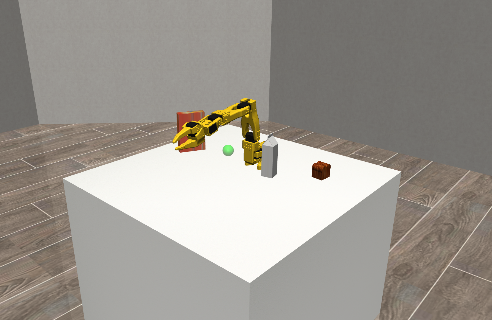
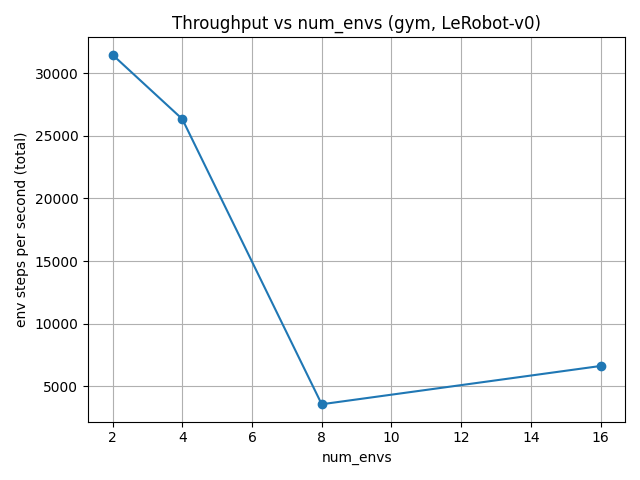

# LeRobotHackathonEnv
Minimal, extendable LeRobot gym environment.



## Installation

**From source:**  
```bash
git clone https://github.com/uakel/LeRobotHackathonEnv.git
cd LeRobotHackathonEnv
uv sync
```

**Via pip:**
With python `>=3.10, <3.13` do
```bash
pip install lerobothackathonenv==0.1.1
```

## Running tests and viewing environment in the MuJoCo renderer
**Note:** The descriptions below only apply if you have installed the repository locally.

**Running Tests:**  
Running the tests will verify that basic functionalities of the environment work. To run all tests defined in the [tests](tests/) directory, run `uv run pytest` within the project's root directory. It might be worthwhile looking at the test scripts as they can be additionally seen as "mini documentation".

**MuJoCo Renderer:**  
The environment provides a function `render_to_window`, which renders the environment in its current state within the MuJoCo viewer. In addition to being able to view the environment, you will be able to manipulate it by applying forces or torques (double-click, ctrl+drag+l(r)mb) to objects within the scene. The `test_env.py` script in the [tests](tests/) directory samples random actions and plays them in the MuJoCo renderer in a loop. You can invoke the script as follows:

```bash
# On linux
uv run tests/mj_viewer_rendering.py
# On OSX (this needs a special python binary to run)
uv run mjpython tests/mj_viewer_rendering.py
```

## Project structure
**Code structure and task management:**  
The repository defines a gymnasium environment in [env.py](src/lerobothackathonenv/env.py), that is given by the `LeRobot` class. The class expects a `ExtendedTask` (See [task.py](src/lerobothackathonenv/tasks.py)) in its constructor which defines one "variation" of the LeRobot environment. The `ExtendedTask` class is designed in a way such that one concrete instance of it fully describes everything that may be varied between different training tasks. This, among other, includes the XML file location, and things like the observation function. People that want to generate task variations should implement subclasses of ExtendedTask. See below for a rough skeleton:

```python
# ~ Import the Extended task
from lerobothackathonenv.tasks import ExtendedTask
# ~ Import the spaces module
from gymnasium import spaces, make
# ~ Typing stuff
from lerobothackathonenv.types import *
# ~ Import the actual gym environment
from lerobothackathonenv.types import *

class MyCustomTask(ExtendedTask):
    # ~ Fill in path to xml here
    XML_PATH = ...

    # ~ Define observation space with the gymnasium spaces
    #   module here
    ACTION_SPACE = ...
    OBSERVATION_SPACE = ...

    # ~ Define observation and reward functions that use
    #   the dm_control physics object as input

    def get_reward(self, physics: Physics) -> float:
        ...

    def get_observation(self, physics: Physics) -> Obs:
        ...

    # ~ Define this function to return the parameters that
    #   further define your environment variations. In
    #   a reach task this for example could be the goal
    #   position

    def get_sim_metadata(self) -> Dict:
        ...

# ~ Register env
register(
    id="LeRobot-v0",
    entry_point="lerobothackathonenv.env:LeRobot",
    kwargs={
        dm_control_task_desc=MyCustomTask()
    }
)


```

**Assets:**  
All non-code files used by the environment are present in the [models](src/lerobothackathonenv/models/) directory. These include things like MuJoCo XML files, stl geometry files and textures. This model directory is a direct copy of the model directory in the MPC codebase, and should be seen as "building blocks" which people creating environment variations should base their variations on. We plan to keep these folders roughly the same across the repositories, such that environment variations can be easily implemented for both codebases at the same time.

## Extracting data for rendering and dataset creation
If a policy has been trained and is now ready for execution, at some point we want to record trajectories that can be handed to the dataset-creation / sim-to-real-gap-overcoming people to create the actual dataset for VLA finetuning. For this the `LeRobot` env provides the `sim_state` property, which is similarly implemented in the [MPC Codebase](https://github.com/martius-lab/mpcjoco). The idea is that a sequence of sim states of this kind is sufficient to recreate a trajectory for rendering in a differently set up environment, specifically optimized for creating useful renders. Since both codebases implement this property, rollouts from both approaches can then be used by for such renders.

## References
- [Gymnasium Docs](https://gymnasium.farama.org/)
- [MuJoCo reference](https://mujoco-fork-k.readthedocs.io/en/latest/overview.html)
- [DM control](https://github.com/google-deepmind/dm_control)
- [SO-101 Robot Repository](https://github.com/TheRobotStudio/SO-ARM100)
- [Onurs/Georgs MPC repository](https://github.com/martius-lab/mpcjoco)

## Vectorized throughput: Gym vs PufferLib

We benchmarked vectorized rollouts of `LeRobot-v0` using Gymnasium's `AsyncVectorEnv` (`gym` backend) and PufferLib's multiprocessing vectorization (`puffer` backend) for `num_envs = 2, 4, 8, 16, 32`.

- Gym AsyncVectorEnv: peaks around ~28k steps/s on this machine.
- PufferLib Multiprocessing: best result so far is ~60k steps/s at `num_envs=16, num_workers=8` (per `results/throughput/throughput_puffer_num_w_8.jsonl`).




To reproduce the sweeps and plots:

```bash
uv run python -m tests.vec_env_throughput --backend gym \
  --sweep-num-envs 2,4,8,16,32 --plot-path results/throughput

uv run python -m tests.vec_env_throughput --backend puffer \
  --sweep-num-envs 2,4,8,16,32 --puffer-num-workers 8 --plot-path results/throughput

# To sweep over different PufferLib worker counts and get one PNG/JSONL per setting:
uv run python -m tests.vec_env_throughput --backend puffer \
  --sweep-num-envs 2,4,8,16,32 --puffer-num-workers 2,4,8,16 --plot-path results/throughput
```

### Minimal PufferLib vector env snippet

```python
import gymnasium as gym
import pufferlib
import pufferlib.vector as pv
from pufferlib.emulation import GymnasiumPufferEnv

import lerobothackathonenv  # registers LeRobot-v0

num_envs = 16

vec_env = pv.make(
    GymnasiumPufferEnv,
    env_args=None,
    env_kwargs={"env_creator": gym.make, "env_args": ["LeRobot-v0"]},
    backend=pv.Multiprocessing,
    num_envs=num_envs,
    num_workers=8,  # best worker setting from the benchmark
    batch_size=num_envs,
)

obs, info = vec_env.reset()
for _ in range(1000):
    actions = vec_env.action_space.sample()
    obs, rewards, terminated, truncated, infos = vec_env.step(actions)

vec_env.close()
```
